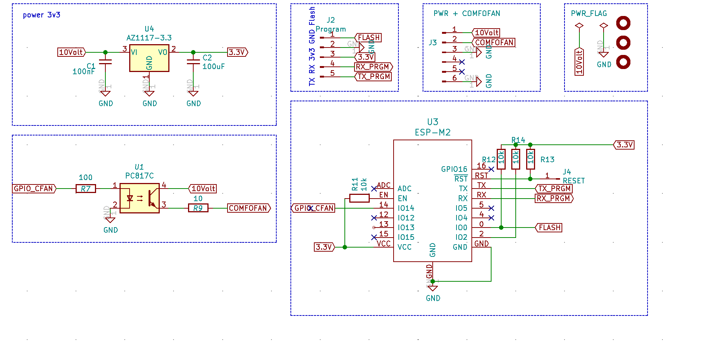

# Comfofan via mqtt aansturen
Ons huis heeft een centrale afzuigunit (Comfofan S). Deze staat normaal alleen op stand laag en zetten we in stand hoog zodra we de onder de douche gaan. Dit wil ik graag via onze domotica server laten lopen (mqtt).

### LET OP !!! ALTIJD Stekker van de fan verwijderen als je hieraan werkt !!! Alle handelingen aan de fan zijn voor eigen risico  

## Doelstelling bij dit project
- Tasmota out of the box gebruiken
- Hergebruik van de V2 slimmemeter hardware (is toch erg generiek)
- past in de behuizing van de fan

## Schema
Ik had nog hardware liggen van de slimme meter - P1 - V2 oplossing. Deze is lekker geniek waardoor deze gemakkelijk te gebruiken is voor deze oplossing.
Technisch gezien volgende nodig:
- voeding minimaal 10V (max 15V)
- optocoupler voor het aansturen van de fan
- ESP(M2) voor het runnen van de Tasmota oplossing

Op basis van de V2 hardware komt dit schema er uit.
 
Het is met name weglaten van componenten van de P1 oplossing.

## Aansluiten
Er komen drie draden uit de print. GND, 10V en stuursignaal naar de fan. 
Daarnaast 2 draden uit de 10 - 15V DC voeding (GND en 10V). 
De GND draden worden beide aan de 0V klem vastgemaakt
De 10V draad van de voeding aan die van de print (DUS NIET AAN DE FAN)
De signaal draad vanuit de print gaat direct naar de 0..10V klem van de FAN.

Nog wel de dipswitch in de fan verzetten (LET OP: stekker er eerst uit halen). 
#5 op ON
#6 op OFF indien stand laag moet blijven indien tasmota switch op off staan en #6 op ON indien de fan uit moet gaan bij zodra tasmota op off staat

## SOFTWARE
Tasmota out of the box (op dit moment 8.5.0) kan er op worden gezet en daarbij GPIO 14 als switch configureren. Voor de rest is de configuratie helemaal naar wens in te vullen.

## Optie
Als optie kan je nog een stepdown converter aan de ESP hangen waarmee je stapsgewijs de zuigkracht van de fan kan regelen. 

